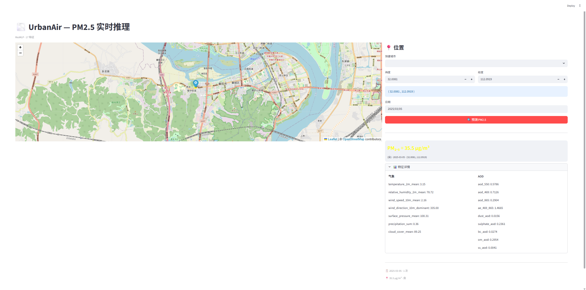
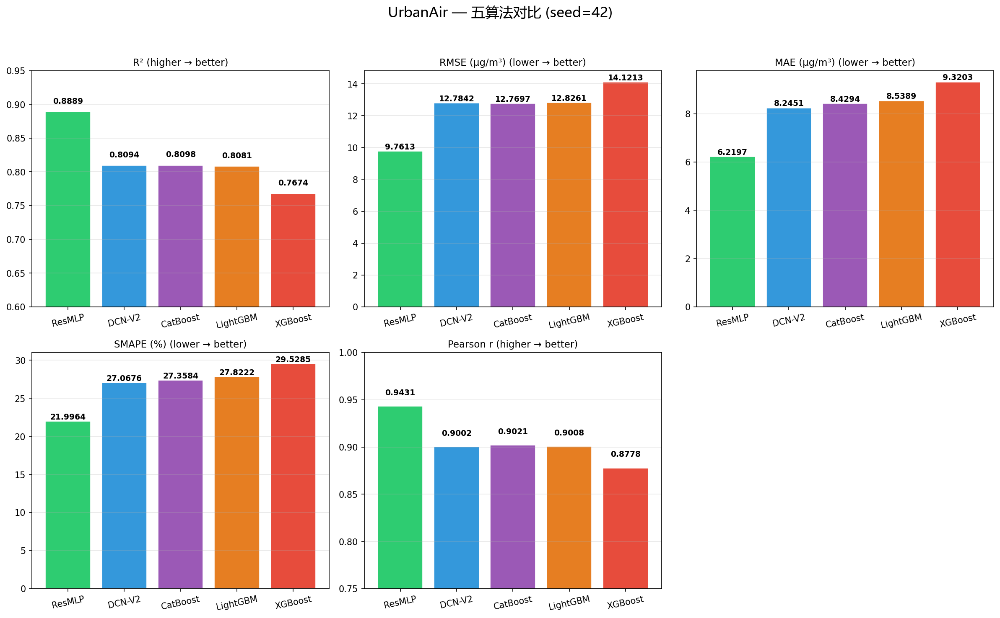

# RetroAir —— 基于卫星 AOD 与气象数据的历史 PM2.5 回顾性推断

**RetroAir** 利用 CAMS 气溶胶再分析数据（AOD）与 NASA 气象数据，结合深度学习模型（ResMLP），推断**无地面监测站覆盖地区**的历史 PM2.5 浓度。核心应用场景：填补监测网络空白区域的历史空气质量数据。

---

## 项目概览

```
气象数据 (NASA POWER) ─┐
                       ├──→ ResMLP 模型 ──→ PM2.5 预测值
气溶胶 AOD (CAMS EAC4) ─┘
```

- **输入**：17 维特征（9 个 AOD 通道 + 7 个气象变量 + 日期编码）
- **输出**：PM2.5 浓度（μg/m³），附空气质量等级
- **模型**：ResMLP（残差多层感知机），10 个随机种子平均 R² ≈ 0.893，RMSE ≈ 9.6 μg/m³
- **覆盖**：全球任意经纬度，2018 年至 CAMS 最新可用年份
- **界面**：Streamlit 交互式 Web 应用，支持地图选点 + 城市快捷选择

---

## 项目结构

```
RetroAir/
├── app.py                          # Streamlit Web 推理应用
├── config.py                       # 全局配置（路径、特征列表、城市坐标）
├── requirements.txt                # Python 依赖
├── README.md                       # 本文件
│
├── data/
│   ├── raw/
│   │   ├── aqi/                     # 地面监测站 PM2.5 标签数据
│   │   ├── weather/                 # 气象日数据（NASA POWER）
│   │   └── cams_nc/                 # CAMS EAC4 NetCDF（气溶胶再分析）
│   ├── processed/
│   │   ├── aod/                     # 提取后的 AOD 站点点特征
│   │   ├── merged/                  # 单城市合并数据集
│   │   └── final/                   # 多城市 FINAL 数据集
│   └── models/
│       └── compare/                 # 训练好的模型权重 & 指标
│
├── scripts/
│   ├── 00_build_dataset.py          # 数据管道编排（AQI→气象→AOD→合并）
│   ├── 01_fetch_aqi.py              # 获取地面监测站 PM2.5 标签
│   ├── 02_fetch_weather.py          # 获取气象日数据
│   ├── 03_fetch_aod.py              # 从 CAMS NetCDF 提取 AOD 特征
│   ├── 04_merge_data.py             # 单城市三源合并
│   ├── 05_merge_to_final.py         # 多城市合并 → FINAL 数据集
│   ├── 06_compare_algorithms.py     # 五算法统一对比 + 可视化
│   ├── inference.py                 # 纯推理管线（无 UI 依赖）
│   ├── common/
│   │   ├── data_utils.py            # 数据加载、标准化、切分、评估指标
│   │   └── torch_utils.py           # PyTorch 训练循环（warmup + 早停）
│   └── models/
│       ├── nn_defs.py               # 神经网络模型定义（ResMLP/DCN-V2/FT-Transformer）
│       ├── runner_utils.py          # 模型保存 & 预测输出
│       ├── train_resmlp.py          # ResMLP 训练入口
│       ├── train_dcnv2.py           # DCN-V2 训练入口
│       ├── train_ft_transformer.py  # FT-Transformer 训练入口
│       ├── train_catboost.py        # CatBoost 训练入口
│       ├── train_lightgbm.py        # LightGBM 训练入口
│       └── train_xgboost.py         # XGBoost 训练入口
│
└── old_repo/                        # 历史实验代码（OSM/MODIS/消融实验）
```

---

## 快速开始

### 1. 安装依赖

```bash
pip install -r requirements.txt
```

### 2. 配置 API Key 与环境变量

项目根目录提供了 `.env.example` 模板。首次运行前请复制为 `.env`，并按需填写自己的 API Key：

```bash
cp .env.example .env
```

Windows PowerShell 可使用：

```powershell
Copy-Item .env.example .env
```

当前项目涉及的数据源说明如下：

| 数据源 | 是否需要 API Key | 说明 |
|------|------|------|
| AKShare 真气网监测站数据 | 否 | `01_fetch_aqi.py` 直接通过 AKShare 接口获取公开数据 |
| NASA POWER 气象数据 | 否 | `02_fetch_weather.py` 和 `scripts/inference.py` 使用公开 Daily API |
| Open-Meteo 气象兜底 | 否 | NASA POWER 请求失败时自动兜底 |
| CAMS EAC4 AOD 数据 | **是** | `03_fetch_aod.py` 下载 NetCDF 时需要 Copernicus ADS 账号和 API Key |

`.env` 中最重要的是：

```dotenv
ADS_API_URL=https://ads.atmosphere.copernicus.eu/api
ADS_API_KEY=your_ads_uid:your_ads_api_key
```

请注意：

1. CAMS EAC4 数据来自 Copernicus Atmosphere Data Store，需要先注册账号并获取 API Key。
2. 获取 Key 后，还需要在 ADS 网页端接受 `cams-global-reanalysis-eac4` 数据集许可；否则脚本会因为权限不足下载失败。
3. 若已手工配置过 `~/.cdsapirc`，脚本会优先使用该文件；若没有，`03_fetch_aod.py` 会尝试根据 `.env` 自动生成 `~/.cdsapirc`。
4. `.env` 已被 `.gitignore` 忽略，请不要把真实 Key 提交到仓库；提交时保留 `.env.example` 作为模板即可。
5. 如果只是复现实验或运行 Web 应用，仓库中已有缓存数据和模型时通常不需要重新下载 CAMS；只有从零构建数据集时才必须配置 ADS Key。

### 3. 构建数据集（以北京为例）

```bash
# 单城市 2018-2025 完整流程
python scripts/00_build_dataset.py --start-year 2018 --end-year 2025 --city 北京

# 合并所有城市为 FINAL 数据集
python scripts/05_merge_to_final.py \
    --input "data/processed/merged/merged_2018_2025_*.csv" \
    --out data/processed/final/merged_8_cities_2018_2025.csv
```

### 4. 运行算法对比

```bash
python scripts/06_compare_algorithms.py
```

### 5. 启动 Web 推理应用

```bash
streamlit run app.py
```



---

## 数据来源

| 数据 | 来源 | 分辨率 | 覆盖 |
|------|------|--------|------|
| **空气质量标签 (PM2.5)** | AKShare 真气网监测站 | 站点级 | 2018-2025，中国 8 城 126 站 |
| **气象数据** | NASA POWER API | 0.5° 日均 | 全球，实时 |
| **气溶胶 AOD** | CAMS EAC4 再分析 (Copernicus ADS) | 0.75° 日均 | 全球，2003-至今 |

---

## 特征体系与消融实验

本项目最终采用 **17 个特征**，分为两组：

| 特征组 | 数量 | 变量 |
|--------|------|------|
| **AOD（气溶胶）** | 9 | `aod_550, aod_469, aod_865, ae_469_865, dust_aod, sulphate_aod, bc_aod, om_aod, ss_aod` |
| **气象** | 7 | `temperature_2m_mean, relative_humidity_2m_mean, wind_speed_10m_mean, wind_direction_10m_dominant, surface_pressure_mean, precipitation_sum, cloud_cover_mean` |
| **时间** | 1 | `day_of_year` |

### 为何放弃 OSM 和 MODIS RGB？

我们在北京数据集上进行了**站点切分的消融实验**（5 折交叉验证，按监测站划分训练/测试集），完整排列组合结果如下：

```
排名  组合                     R²       RMSE     特征数
──────────────────────────────────────────────────────
 1    气象+AOD                 0.9089    9.40     17
 2    气象+AOD+OSM             0.8979    9.98     28     ← OSM 导致 R² 下降
 3    气象+AOD+RGB             0.8967   10.06     27     ← RGB 导致 R² 下降
 4    气象+AOD+OSM+RGB         0.8883   10.50     38     ← 两者都加更差
 ...
14    OSM 单独                 0.1906   28.93     12     ← 基本无预测能力
15    RGB 单独                 0.1498   29.63     11     ← 基本无预测能力
```

**结论**：
- **OSM 空间特征**（道路密度、建筑密度、土地利用占比）和 **MODIS RGB 反射率特征**在任何组合下均为模型带来**零增益甚至负增益**；二者单独使用时 R² 不足 0.2，无法独立预测 PM2.5
- AOD 和气象数据已包含足够的信息（R²=0.91），OSM/RGB 的加入引入了不相关噪声
- 根本原因：OSM 是静态土地利用代理，无法反映 PM2.5 的时间变化；MODIS 地表反射率看的是**地面**而非**大气中的气溶胶**

因此，最终模型仅保留 **气象 + AOD + 时间** 三个维度的特征。

---

## 模型对比

8 城市 310,756 样本，随机切分，使用 10 个随机种子（42–51）重复实验后按平均水平对比：

| 模型 | R² mean±std | RMSE mean±std | MAE mean±std | SMAPE% mean±std | 参数量 |
|------|-----|------|-----|--------|--------|
| **ResMLP (warmup)** | **0.8929±0.0031** | **9.59±0.14** | **6.20±0.04** | **21.9±0.1** | 144K |
| CatBoost | 0.8146±0.0034 | 12.61±0.12 | 8.40±0.02 | 27.3±0.1 | — |
| DCN-V2 | 0.8132±0.0042 | 12.66±0.12 | 8.22±0.03 | 27.0±0.1 | 48K |
| LightGBM | 0.8119±0.0032 | 12.70±0.11 | 8.53±0.03 | 27.8±0.1 | — |
| XGBoost | 0.7727±0.0037 | 13.96±0.11 | 9.29±0.03 | 29.5±0.1 | — |



ResMLP（带 warmup 的残差 MLP）在 10 个随机种子的平均指标上均保持领先，Pearson 相关系数平均约为 0.945。推理应用中使用的即为此模型。

---

## 评估指标说明

| 指标 | 含义 | 方向 |
|------|------|------|
| R² | 决定系数，模型解释了目标变量方差的比例 | ↑ 越高越好 |
| RMSE | 均方根误差，单位 μg/m³ | ↓ 越低越好 |
| MAE | 平均绝对误差 | ↓ 越低越好 |
| SMAPE | 对称平均绝对百分比误差（对零值鲁棒） | ↓ 越低越好 |
| MAPE | 平均绝对百分比误差（仅对 PM2.5 ≥ 1 计算） | ↓ 越低越好 |
| Pearson r | 预测值与真实值的线性相关系数 | ↑ 越高越好 |

MAPE 仅对 PM2.5 ≥ 1 的样本计算，避免分母为零导致的数值爆炸。

---

## 已知局限

1. **极端污染事件被低估**：PM2.5 > 150 μg/m³ 时模型偏差约 -18.8 μg/m³，因训练集中此类样本仅占 0.3%
2. **2026 年后 AOD 数据需等 CAMS 更新**：当前并没有2026数据可使用
3. **空间分辨率**：CAMS EAC4 为 0.75°（约 80km），对局部微环境不敏感

---

## 依赖

主要依赖：`pandas`, `numpy`, `scikit-learn`, `torch`, `lightgbm`, `xgboost`, `catboost`, `xarray`, `netCDF4`, `cdsapi`, `akshare`, `streamlit`, `folium`, `streamlit-folium`, `matplotlib`, `python-dotenv`
